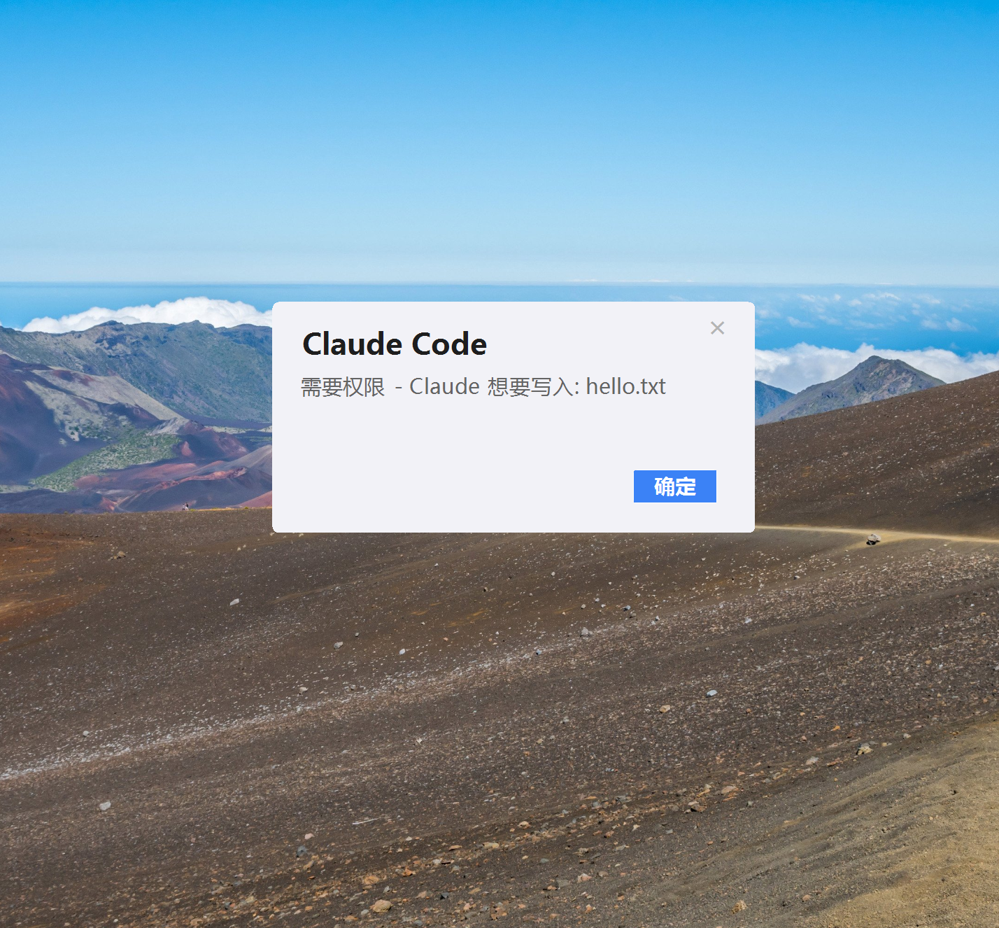

# claude-toast-notify

[English](./README.en.md)

Claude Code 的 Windows Toast 通知和权限弹窗插件。

在 Claude Code 请求工具权限时显示居中弹窗，在任务完成时显示右下角气泡通知。

## 效果




## 功能

- **权限弹窗** — 居中窗口，显示工具名称和参数，带"确定"按钮
- **任务完成通知** — 右下角气泡，5 秒自动消失
- **终端激活** — 点击通知自动切换回终端窗口
- **多会话隔离** — 每个 Claude Code 会话独立状态追踪
- **DPI 自适应** — 高分辨率屏幕正常渲染
- **零外部依赖** — 仅使用 Windows 内置 API 和 WinForms

## 环境要求

- Windows 10 / 11
- PowerShell 5.1+
- .NET Framework 4.5+（WinForms 和 Drawing 程序集，Windows 自带）
- [Claude Code](https://claude.ai)

## 安装

### 方法一：从 GitHub 直接安装（推荐）

在 Claude Code 中运行以下两条命令：

```
/plugin marketplace add outao499/claude-toast-notify
/plugin install claude-toast-notify@claude-toast-notify
```

重启 Claude Code 后自动生效。

### 方法二：一键安装脚本

以管理员身份打开 PowerShell，运行：

```powershell
powershell -NoProfile -ExecutionPolicy Bypass -c "iex (Invoke-RestMethod https://raw.githubusercontent.com/outao499/claude-toast-notify/main/install.ps1)"
```

脚本会自动下载插件并配置 Claude Code 设置。

### 方法三：手动安装

克隆仓库后，在 Claude Code 中运行：

```
/plugin marketplace add C:\path\to\claude-toast-notify
/plugin install claude-toast-notify@claude-toast-notify
```

## 工作原理

通过三个 [Claude Code Hook](https://docs.anthropic.com/en/docs/claude-code/hooks) 事件驱动：

| Hook 事件              | 触发时机                          | 行为                                    |
|------------------------|----------------------------------|-----------------------------------------|
| `UserPromptSubmit`     | 用户发送消息                     | 保存终端句柄 + 开始时间（静默）          |
| `Stop`                 | Claude Code 完成一次响应         | 显示气泡通知，附带耗时                  |
| `PermissionRequest`    | 工具需要用户批准                  | 显示居中的权限弹窗                      |

点击弹窗或气泡时，通过三层策略激活终端窗口：已保存句柄 → 进程名搜索 → `GetConsoleWindow()`。

## 更新

有新版本时，在 Claude Code 中运行：

```
/plugin marketplace update claude-toast-notify
claude plugin update claude-toast-notify@claude-toast-notify
```

或者重新运行安装脚本：

```powershell
iex (Invoke-RestMethod https://raw.githubusercontent.com/outao499/claude-toast-notify/main/install.ps1)
```

## 测试

```powershell
# 气泡通知
.\scripts\claude_toast_notify.ps1 -Mode balloon

# 权限弹窗（管道传入模拟 payload）
'{"tool_name":"Write","tool_input":{"file_path":"test.txt"}}' | .\scripts\claude_toast_notify.ps1 -Mode popup
```

## 许可证

MIT
